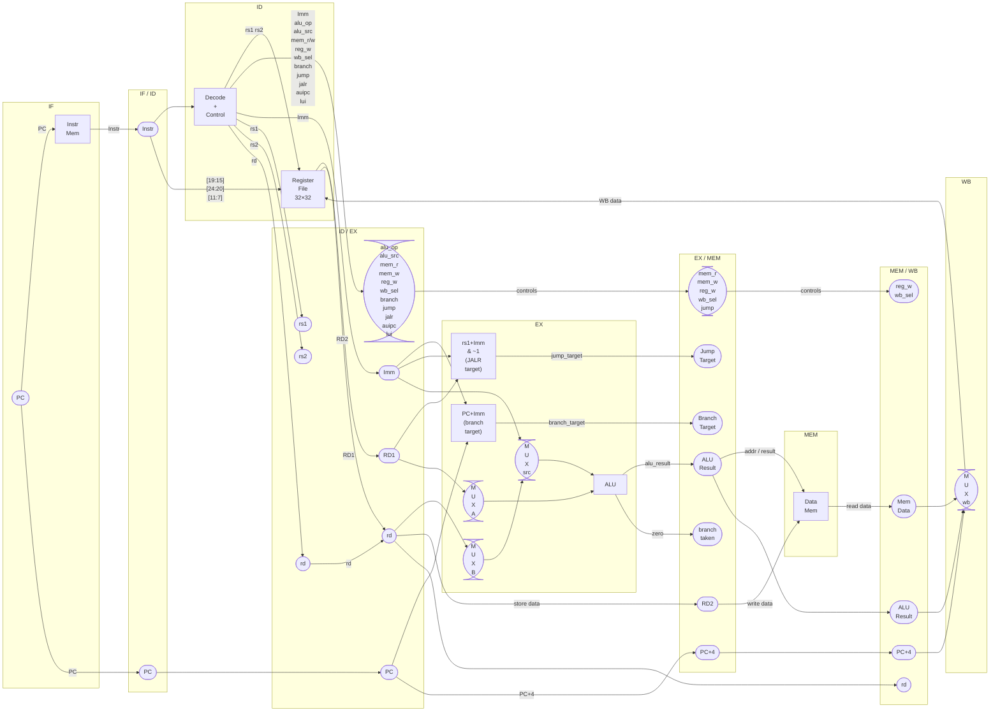
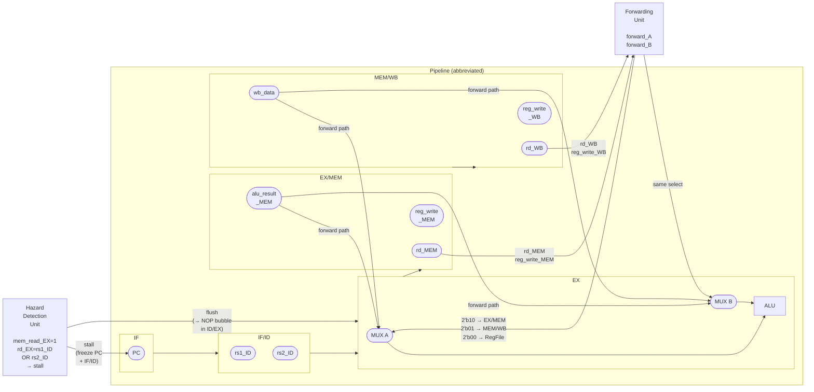
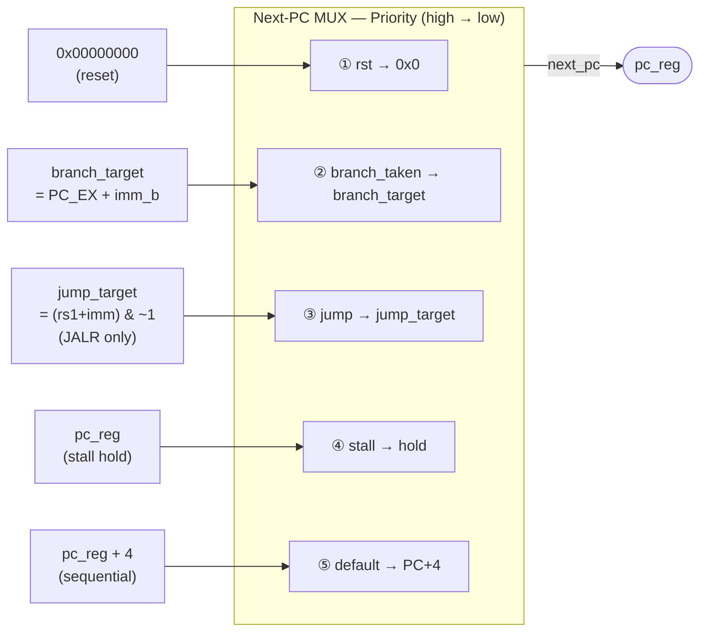
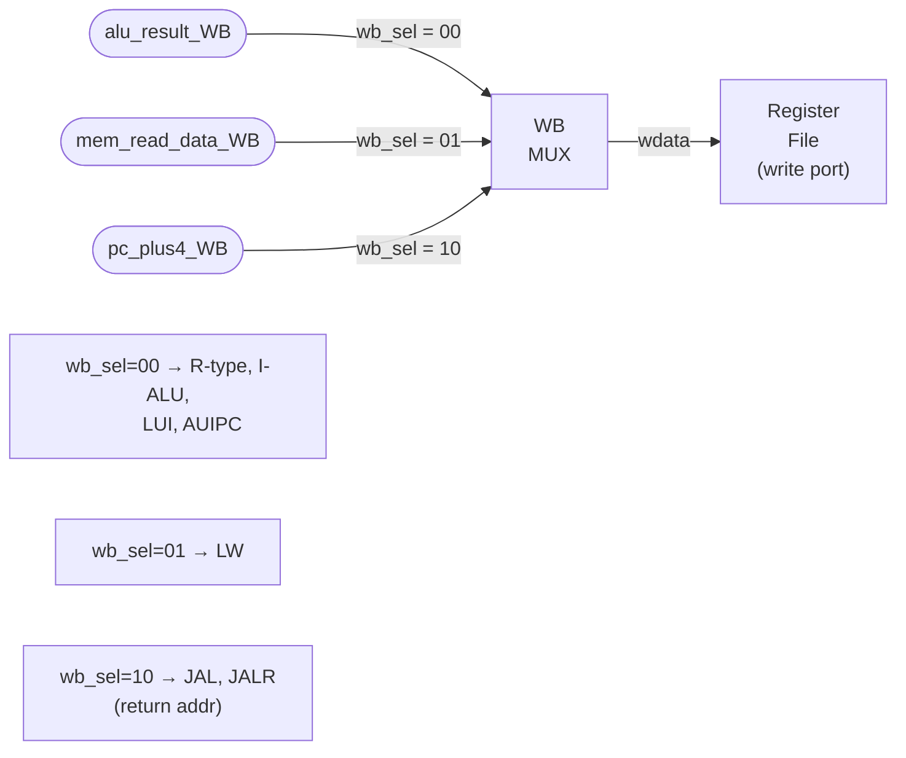
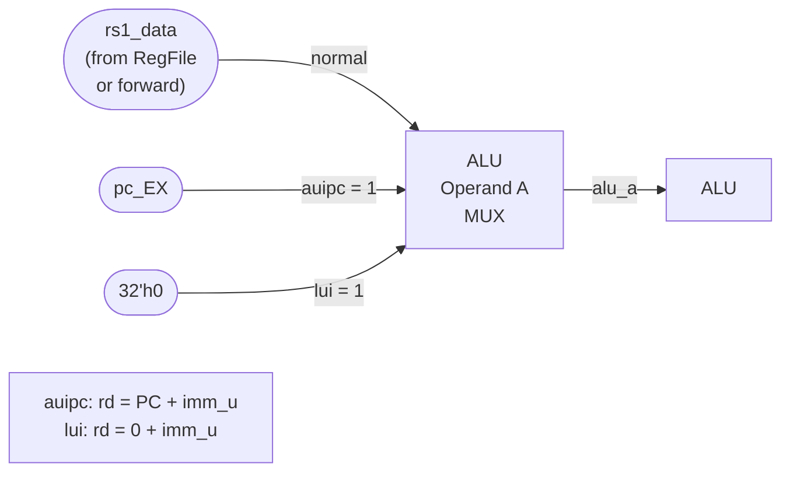
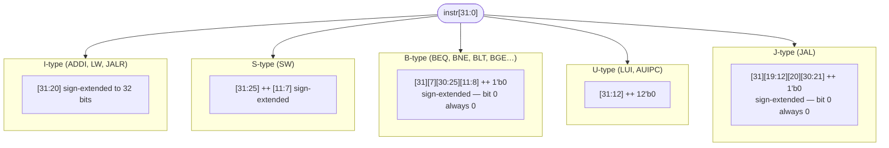
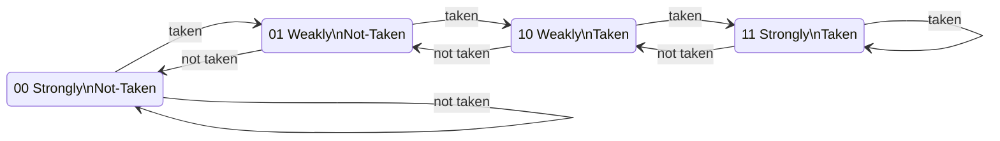

# BoseRV — RISC-V Pipelined Datapath
> Style: David Harris & Sarah Harris, *Digital Design and Computer Architecture*

---

## Complete Pipelined Datapath



---

## Hazard Unit + Forwarding Unit Overlay



---

## PC Next MUX — Full Priority Chain



---

## Writeback MUX



---

## ALU Operand A MUX — LUI / AUIPC Special Routing



---

## Decoder — Immediate Formats



---

## Control Signal Truth Table

| Instruction | `alu_src` | `mem_r` | `mem_w` | `reg_w` | `wb_sel` | `branch` | `jump` | `jalr` | `auipc` | `lui` |
|---|:---:|:---:|:---:|:---:|:---:|:---:|:---:|:---:|:---:|:---:|
| **R-type** (ADD, SUB…) | 0 | 0 | 0 | 1 | 00 | 0 | 0 | 0 | 0 | 0 |
| **I-ALU** (ADDI, ANDI…)| 1 | 0 | 0 | 1 | 00 | 0 | 0 | 0 | 0 | 0 |
| **LW** | 1 | 1 | 0 | 1 | 01 | 0 | 0 | 0 | 0 | 0 |
| **SW** | 1 | 0 | 1 | 0 | — | 0 | 0 | 0 | 0 | 0 |
| **BEQ/BNE/BLT…** | 0 | 0 | 0 | 0 | — | 1 | 0 | 0 | 0 | 0 |
| **LUI** | 1 | 0 | 0 | 1 | 00 | 0 | 0 | 0 | 0 | 1 |
| **AUIPC** | 1 | 0 | 0 | 1 | 00 | 0 | 0 | 0 | 1 | 0 |
| **JAL** | — | 0 | 0 | 1 | 10 | 0 | 1 | 0 | 0 | 0 |
| **JALR** | 0 | 0 | 0 | 1 | 10 | 0 | 1 | 1 | 0 | 0 |

---

## ALU Operations

| `alu_op` | Operation | Used by |
|---|---|---|
| `0000` | A + B | ADD, ADDI, LW/SW addr, AUIPC, LUI |
| `0001` | A − B | SUB, BEQ/BNE compare |
| `0010` | A & B | AND, ANDI |
| `0011` | A \| B | OR, ORI |
| `0100` | A ^ B | XOR, XORI |
| `0101` | A << B[4:0] | SLL, SLLI |
| `0110` | A >> B[4:0] | SRL, SRLI (logical) |
| `0111` | A >>> B[4:0] | SRA, SRAI (arithmetic) |
| `1000` | signed(A) < signed(B) | SLT, SLTI, BLT, BGE |
| `1001` | A < B (unsigned) | SLTU, SLTIU, BLTU, BGEU |

---

## Branch History Table — 2-Bit Saturating Counter



> **Index:** `pc_in[7:2]` → 6-bit → selects 1 of 64 counters.  
> **Predict:** `counter[1]` (MSB) — 1 = predict taken.  
> **Reset:** all counters → `2'b01` (Weakly Not-Taken).

---

## Pipeline Register Summary

| Register | Holds | On `rst` / `flush` | On `stall` |
|---|---|---|---|
| **IF/ID** | PC, Instr | → `0` (NOP) | freeze (hold) |
| **ID/EX** | All decode outputs + data | → `0` (all control=0) | → `0` (bubble) |
| **EX/MEM** | ALU result, store data, targets, control | → `0` | — |
| **MEM/WB** | ALU result, mem data, PC+4, control | → `0` | — |

---

## Load-Use Hazard — Why Forwarding Is Not Enough

```
Cycle      :   3         4         5         6
           ──────────────────────────────────────
lw  x1,0(x0): IF  →  ID  →  EX  →  MEM  →  WB
add x4,x1,x2:          IF  →  ID  → [stall] →  EX  →  MEM  → WB
                                 ↑
                           x1 needed here (start of EX)
                           but lw only produces it at end of MEM
                           → impossible without 1-cycle stall
```

Forwarding only helps after `lw` reaches **MEM** — by then `add` already needs `x1` at **EX** input.

---

## Forwarding Paths

```
Situation             forward_A/B   Source
──────────────────────────────────────────────
No hazard             2'b00         Register file (rdata1/rdata2)
EX-EX hazard          2'b10         alu_result_MEM  (1 cycle old)
MEM-EX hazard         2'b01         writeback_data  (2 cycles old)

EX-EX takes priority over MEM-EX when both match.
```
