# BoseRV — Complete RISC-V Architecture
> Harris & Harris style · Every wire matches the actual Verilog source

---

## 1. BoseRV Chip — Top-Level View

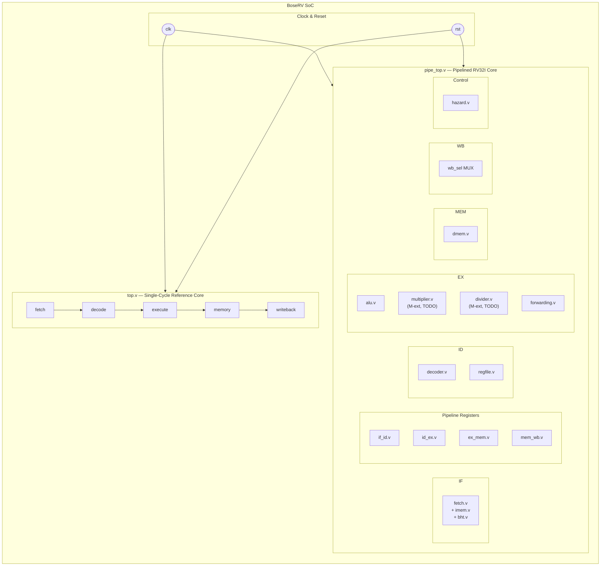

---

## 2. Full Pipelined Datapath — pipe_top.v

> One diagram — every stage, every MUX, every pipeline register, every control wire.

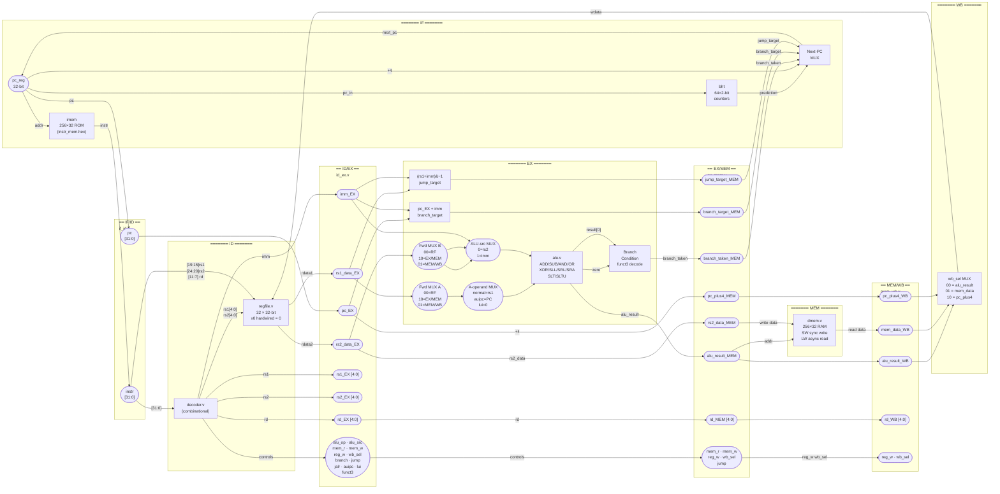

---

## 3. Hazard & Forwarding Unit Connections

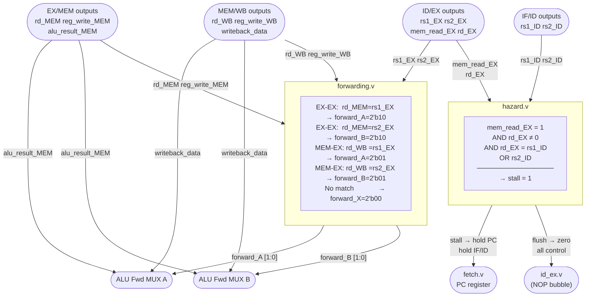

---

## 4. Branch Condition Decoder — Inside EX Stage

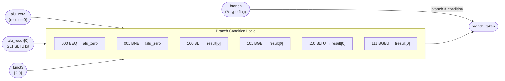

---

## 5. ALU Operand Routing — Full MUX Chain

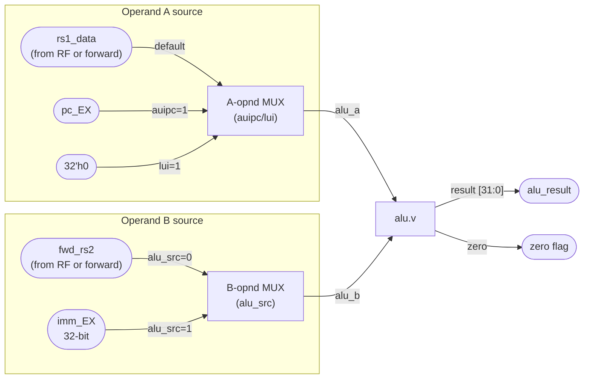

---

## 6. Writeback MUX

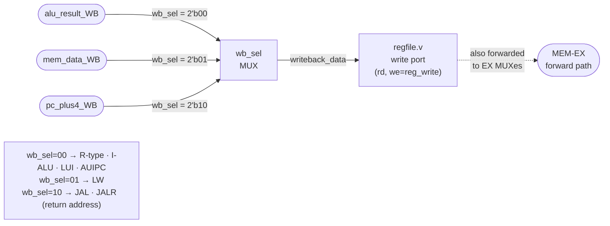

---

## 7. BHT — Branch History Table

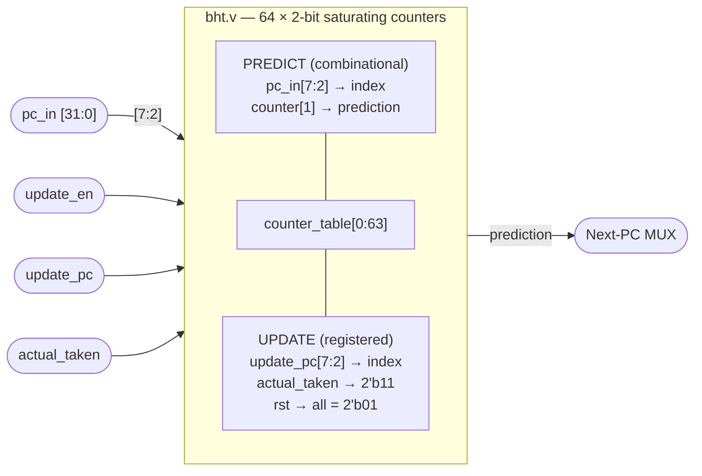

**2-bit counter state machine:**

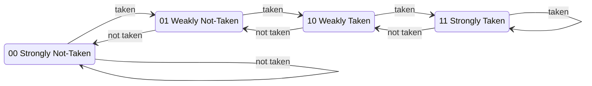

---

## 8. Single-Cycle Reference Core — top.v

> `top.v` is the original single-cycle version. `pipe_top.v` is the pipelined upgrade.
> Both use the same leaf modules: `fetch`, `decoder`, `regfile`, `alu`, `dmem`.

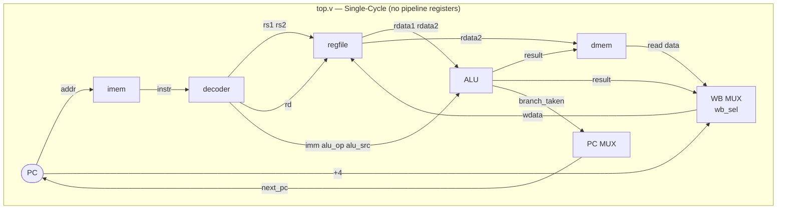

**Key difference from pipelined:**

| | `top.v` single-cycle | `pipe_top.v` pipelined |
|---|---|---|
| Pipeline registers | None | IF/ID · ID/EX · EX/MEM · MEM/WB |
| Hazard handling | Not needed | `hazard.v` — load-use stall |
| Forwarding | Not needed | `forwarding.v` — EX-EX & MEM-EX |
| Branch predictor | Not present | `bht.v` — 2-bit saturating |
| CPI (ideal) | 1 (but slow clock) | ~1 (fast clock, stalls on hazard) |

---

## 9. Future: M-Extension (multiplier.v · divider.v)

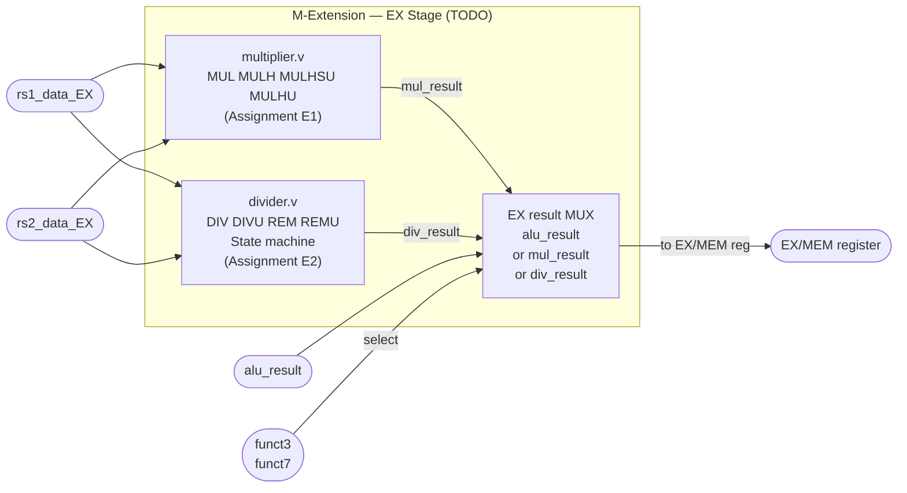

---

## 10. Complete Module Hierarchy

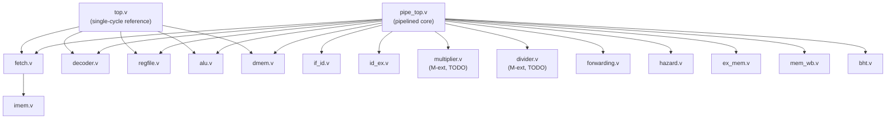

---

## 11. Signal Name Reference — Exact Wire Names from pipe_top.v

| Signal | Stage suffix | Example | Meaning |
|---|---|---|---|
| `pc` | `_IF _ID _EX` | `pc_EX` | Program counter at that stage |
| `instr` | — | `instr_IF` | Raw 32-bit instruction |
| `rs1_data` | `_ID _EX` | `rs1_data_EX` | Register file read 1 |
| `rs2_data` | `_ID _EX _MEM` | `rs2_data_MEM` | Register file read 2 / store data |
| `alu_result` | `_EX _MEM _WB` | `alu_result_MEM` | ALU output |
| `mem_read_data` | `_MEM _WB` | `mem_read_data_WB` | dmem read output |
| `pc_plus4` | `_MEM _WB` | `pc_plus4_WB` | Return address |
| `branch_target` | `_MEM` | `branch_target_MEM` | PC + imm_b |
| `jump_target` | `_MEM` | `jump_target_MEM` | (rs1+imm)&~1 |
| `branch_taken` | `_EX _MEM` | `branch_taken_MEM` | Branch condition result |
| `writeback_data` | — | `writeback_data` | Final WB MUX output |
| `fwd_rs1` | — | `fwd_rs1` | rs1 after forwarding MUX |
| `fwd_rs2` | — | `fwd_rs2` | rs2 after forwarding MUX |
| `forward_A/B` | — | `forward_A` | 2-bit MUX select from forwarding unit |
| `stall` | — | `stall` | 1 = freeze PC + IF/ID |
| `flush` | — | `flush` | 1 = zero ID/EX controls (NOP bubble) |
| `prediction` | — | `prediction` | BHT branch prediction |
