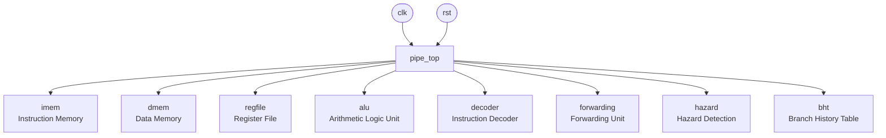
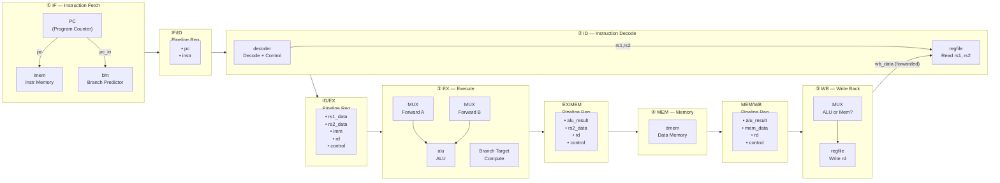
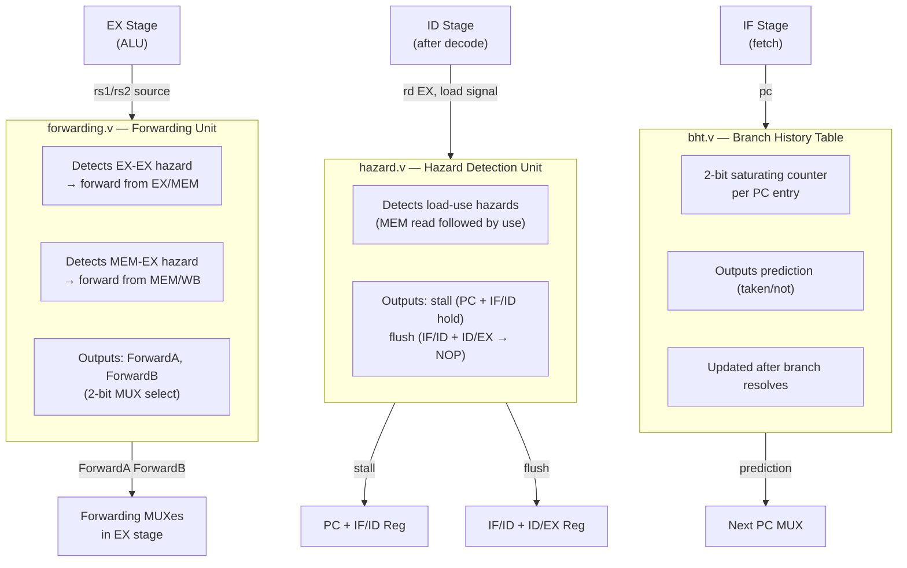

# RISC-V 5-Stage Pipeline Architecture

This document visualizes the full architecture of this RISC-V core, matching the modules in `riscv-core/src/`.

---

## 1. Top-Level Overview



---

## 2. Full 5-Stage Pipeline Datapath



---

## 3. Hazard & Forwarding Control



---

## 4. Branch & Jump Logic

```mermaid
flowchart LR
    PC -->|current pc| ADDER1["PC + 4"]
    PC -->|current pc| BHT_PRED["bht\nprediction"]
    BHT_PRED -->|taken?| MUX_PC["Next PC MUX"]
    ADDER1 --> MUX_PC

    EX["EX Stage"] -->|branch_target\n= pc + imm| MUX_PC
    EX -->|branch_taken\n(ALU zero / compare)| CORRECT["Correction Logic"]
    CORRECT -->|misprediction flush| MUX_PC

    MUX_PC -->|next_pc| PC
```

---

## 5. Module Inventory

| Module | Stage | Role |
|---|---|---|
| `fetch.v` | IF | Drives PC, reads `imem` |
| `imem.v` | IF | Instruction ROM |
| `bht.v` | IF | 2-bit branch predictor |
| `if_id.v` | IF→ID | Pipeline register |
| `decoder.v` | ID | Decodes opcode, generates control signals |
| `regfile.v` | ID/WB | 32 × 32-bit register file |
| `id_ex.v` | ID→EX | Pipeline register |
| `alu.v` | EX | ADD/SUB/AND/OR/SLT/shifts |
| `multiplier.v` | EX | MUL/MULH (M-ext) |
| `divider.v` | EX | DIV/REM (M-ext) |
| `forwarding.v` | EX | Data hazard forwarding MUX select |
| `hazard.v` | ID/EX | Load-use stall + flush |
| `ex_mem.v` | EX→MEM | Pipeline register |
| `dmem.v` | MEM | Data memory (load/store) |
| `mem_wb.v` | MEM→WB | Pipeline register |
| `pipe_top.v` | ALL | Wires all stages together |
| `top.v` | SoC | Top-level chip wrapper |

---

## 6. Pipeline Register Data Flow (Signal Names)

```mermaid
flowchart LR
    subgraph IF_wires["IF wires"]
        pc_IF["pc_IF"]
        instr_IF["instr_IF"]
    end

    subgraph ID_wires["ID wires (after IF/ID)"]
        pc_ID["pc_ID"]
        rs1_data_ID["rs1_data_ID"]
        rs2_data_ID["rs2_data_ID"]
        imm_ID["imm_ID"]
        rd_ID["rd_ID"]
    end

    subgraph EX_wires["EX wires (after ID/EX)"]
        alu_result_EX["alu_result_EX"]
        rs2_data_EX["rs2_data_EX"]
        rd_EX["rd_EX"]
    end

    subgraph MEM_wires["MEM wires (after EX/MEM)"]
        alu_result_MEM["alu_result_MEM"]
        mem_read_data["mem_read_data"]
        rd_MEM["rd_MEM"]
    end

    subgraph WB_wires["WB wires (after MEM/WB)"]
        alu_result_WB["alu_result_WB"]
        mem_read_data_WB["mem_read_data_WB"]
        rd_WB["rd_WB"]
    end

    IF_wires --> ID_wires --> EX_wires --> MEM_wires --> WB_wires
```


